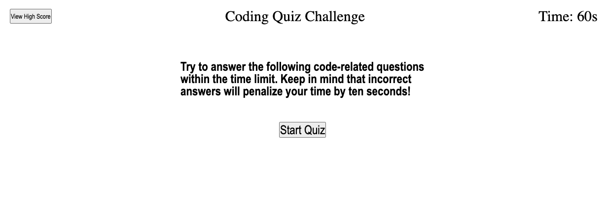

# CodingQuiz-WebAPIs

## Description

This homework assignment challanged me to build a quiz game of coding questions that the user could answer. The user's right or wrong answers determine the score. This project relies on JavaScript/HTML/CSS to run.

## Installation

No installation required for this web application.

## Usage

Link to website:
https://lhwood.github.io/CodingQuiz-WebAPIs/

## Credits

I referenced W3Schools and MDN Web Docs while completing this project.

---
